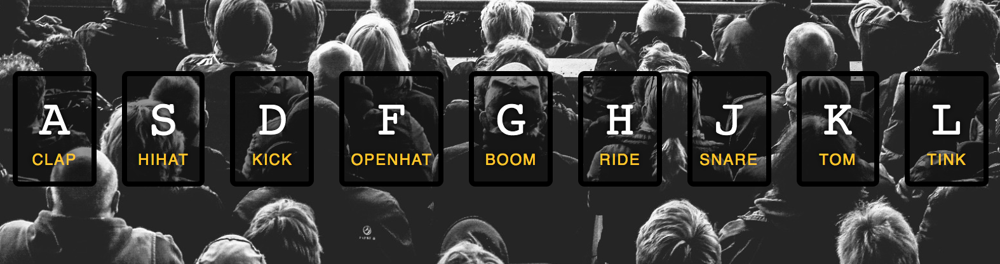

## Instructions
Press the button on your keyboard corresponding to the letter on the screen. Each letter is linked to a sound. 

## How this was made
This program was built by adding vanilla JavaScript to files already containing audio files. Vanilla JavaScript, HTML5 & CSS is used without jQuery. 

## This program demonstrates
1. HTML5 Custom Data Attributes (data-*)
2. Keyboard Events
3. Playing Audio
4. CSS & Transition 
5. Ending Events
6. Animation
7. Animation End Event

## Preview

